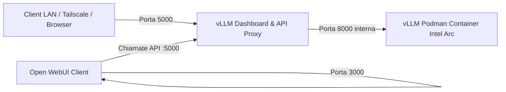

# ⚡ vLLM Intel Arc Server & Manager

> **Server di Inferenza LLM locale & Web Dashboard per GPU Intel Arc (Linux)**  
> *Compatibile al 100% con le API OpenAI e Ollama, con funzionalità di auto-loading dei modelli via LAN e Tailscale.*

---

## 📑 INDICE DEI CONTENUTI

- [1. Panoramica & Architettura](#1-panoramica--architettura)
  - [1.1 Cos'è il progetto](#11-cosè-il-progetto)
  - [1.2 Come funziona il sistema "Stile Ollama"](#12-come-funziona-il-sistema-stile-ollama)
  - [1.3 Mappa delle Porte di Rete](#13-mappa-delle-porte-di-rete)
  - [1.4 Hardware Supportato](#14-hardware-supportato)
- [2. Installazione & Primo Avvio](#2-installazione--primo-avvio)
  - [2.1 Installazione Rapida in un Click (`configure_pc.sh`)](#21-installazione-rapida-in-un-click-configure_pcsh)
  - [2.2 Installazione Manuale Passo-Passo](#22-installazione-manuale-passo-passo)
  - [2.3 Accesso alla Dashboard Web](#23-accesso-alla-dashboard-web)
- [3. Download & Gestione dei Modelli LLM](#3-download--gestione-dei-modelli-llm)
  - [3.1 Directory dei Modelli (`~/my_models`)](#31-directory-dei-modelli-my_models)
  - [3.2 Modelli AWQ Consigliati per 16GB VRAM (Intel Arc B580)](#32-modelli-awq-consigliati-per-16gb-vram-intel-arc-b580)
- [4. Configurazione del Server](#4-configurazione-del-server)
  - [4.1 Gerarchia di Configurazione](#41-gerarchia-di-configurazione)
  - [4.2 Configurazione via YAML (`vllm-dashboard.yaml`)](#42-configurazione-via-yaml-vllm-dashboardyaml)
  - [4.3 Configurazione via Variabili d'Ambiente (`.env`)](#43-configurazione-via-variabili-dambiente-env)
  - [4.4 Sicurezza, CORS e Protezione con API Key](#44-sicurezza-cors-e-protezione-con-api-key)
- [5. Guida all'Integrazione dei Client (LAN & Tailscale)](#5-guida-allintegrazione-dei-client-lan--tailscale)
  - [5.1 Indirizzi di Rete per la Connessione](#51-indirizzi-di-rete-per-la-connessione)
  - [5.2 Open WebUI (Interfaccia Chat)](#52-open-webui-interfaccia-chat)
  - [5.3 Continue.dev (Estensione per VS Code & JetBrains)](#53-continuedev-estensione-per-vs-code--jetbrains)
  - [5.4 Cursor IDE](#54-cursor-ide)
  - [5.5 Script Python con SDK Ufficiale `openai`](#55-script-python-con-sdk-ufficiale-openai)
  - [5.6 Esempi `curl` da Terminale](#56-esempi-curl-da-terminale)
- [6. Riferimento Completo delle API & WebSocket](#6-riferimento-completo-delle-api--websocket)
  - [6.1 Endpoint di Monitoraggio & Health Check](#61-endpoint-di-monitoraggio--health-check)
  - [6.2 Endpoint Compatibili OpenAI (`/v1/...`)](#62-endpoint-compatibili-openai-v1)
  - [6.3 Endpoint Compatibili Ollama (`/api/...`)](#63-endpoint-compatibili-ollama-api)
  - [6.4 Canali WebSocket in Tempo Reale](#64-canali-websocket-in-tempo-reale)
- [7. Manutenzione, Backup & Test](#7-manutenzione-backup--test)
  - [7.1 Gestione del Servizio Systemd](#71-gestione-del-servizio-systemd)
  - [7.2 Script di Backup e Ripristino dei Modelli](#72-script-di-backup-e-ripristino-dei-modelli)
  - [7.3 Esecuzione dei Test Unitari (`pytest`)](#73-esecuzione-dei-test-unitari-pytest)
- [8. Domande Frequenti & Troubleshooting (FAQ)](#8-domande-frequenti--troubleshooting-faq)

---

# 1. Panoramica & Architettura

### 1.1 Cos'è il progetto
**vLLM Intel Arc Server & Manager** è una piattaforma completa che consente di utilizzare la tecnologia di inferenza ad alte prestazioni **vLLM** accelerata via hardware su **GPU Intel Arc (driver Xe)**. 

Il sistema è pensato per trasformare la macchina Linux in un **server AI domestico o aziendale**, sempre pronto a rispondere alle richieste di chat e generazione codice provenienti da tutta la rete locale o da remoto.

### 1.2 Come funziona il sistema "Stile Ollama"
A differenza dei setup tradizionali dove devi avviare a mano i container per ogni modello:
1. **Server Leggero in Idle**: Quando nessun modello è in uso, il backend FastAPI consuma appena **~45 MB di RAM** e **0% di VRAM**.
2. **Auto-Loading Dinamico**: Quando un client (es. Open WebUI o Continue) invia un prompt richiedendo uno specifico modello (es. `Qwen2.5-Coder-7B-Instruct-AWQ`), il server rileva se è già attivo. In caso contrario, avvia automaticamente il container Podman con il modello selezionato.
3. **Auto-Switching**: Se un'altra applicazione richiede un modello diverso, il server arresta in sicurezza il modello precedente e carica quello nuovo in VRAM in pochi secondi.

### 1.3 Mappa delle Porte di Rete



| Porta | Componente | Descrizione |
|---|---|---|
| **`5000`** | **vLLM Server & Manager** | **La porta principale.** Espone la Web Dashboard, le API OpenAI (`/v1/...`), le API Ollama (`/api/...`) e i WebSockets per la telemetria. |
| **`8000`** | **vLLM Container (Interna)** | Porta su cui ascolta il container vLLM. Viene gestita internamente dal proxy senza bisogno di esporla all'esterno. |
| **`3000`** | **Open WebUI (Opzionale)** | Porta standard usata qualora decidessi di installare Open WebUI come interfaccia chat separata. |

### 1.4 Hardware Supportato
* **GPU Intel Arc Battlemage**: Intel Arc B580 (16GB), B570 (10GB)
* **GPU Intel Arc Alchemist**: Intel Arc A770 (16GB/8GB), A750 (8GB), A580, A380
* **Processori Intel Core Ultra** (Meteor Lake / Arrow Lake con GPU Intel Arc integrata)
* **Intel Data Center GPU Flex / Max**

---

# 2. Installazione & Primo Avvio

### 2.1 Installazione Rapida in un Click (`configure_pc.sh`)
Il modo più semplice per preparare l'intero ambiente è usare lo script di configurazione interattivo:

```bash
git clone https://github.com/tuo-utente/vllm-intel-arc-dashboard.git
cd vllm-intel-arc-dashboard
chmod +x configure_pc.sh
./configure_pc.sh
```

Lo script effettua in automatico:
- Verifica e installazione di Podman.
- Assegnazione dei permessi utente per la GPU (`groups render video`).
- Creazione del virtual environment Python e installazione delle dipendenze.
- Registrazione e avvio del servizio Systemd in autostart.
- Download guidato dei modelli scelti in `~/my_models`.

### 2.2 Installazione Manuale Passo-Passo
Se preferisci configurare i componenti manualmente:

```bash
# 1. Installa i pacchetti necessari (Debian/Ubuntu)
sudo apt update && sudo apt install -y podman python3-venv python3-pip

# 2. Configura i permessi per la GPU Intel
sudo usermod -aG render,video $USER

# 3. Prepara il Virtual Environment Python
python3 -m venv venv
./venv/bin/pip install --upgrade pip
./venv/bin/pip install -r requirements.txt

# 4. Crea la cartella dei modelli
mkdir -p ~/my_models

# 5. Installa il servizio di autostart per l'utente corrente
mkdir -p ~/.config/systemd/user
cp vllm-dashboard.service ~/.config/systemd/user/
systemctl --user daemon-reload
systemctl --user enable --now vllm-dashboard.service
```

### 2.3 Accesso alla Dashboard Web
Apri il browser sul PC o da qualsiasi dispositivo nella tua rete locale:
👉 **`http://localhost:5000`** (oppure `http://192.168.x.x:5000`)

1. Al primo avvio, se l'immagine Docker non è presente, clicca su **`📥 Scarica Immagine vLLM`**.
2. Seleziona il modello dal menu a tendina e premi **`▶️ Avvia Modello`**.
3. Puoi subito interagire con l'LLM tramite la finestra di **Test Chat** integrata!

---

# 3. Download & Gestione dei Modelli LLM

### 3.1 Directory dei Modelli (`~/my_models`)
I modelli vengono salvati nella directory `~/my_models`. Ciascun modello deve risiedere in una propria sottocartella contenente i file dei pesi (`.safetensors`), il `config.json` e il `tokenizer.json`.

### 3.2 Modelli AWQ Consigliati per 16GB VRAM (Intel Arc B580)
I seguenti comandi scaricano modelli pre-quantizzati a 4-bit (AWQ) altamente ottimizzati per la GPU Intel Arc:

#### 💻 1. Qwen 2.5 Coder 7B AWQ (Programmazione & Codice)
```bash
podman run --rm -it \
  -v ~/my_models:/download \
  docker.io/library/python:3.11-slim \
  bash -c "pip install --no-cache-dir huggingface_hub && hf download Qwen/Qwen2.5-Coder-7B-Instruct-AWQ --local-dir /download/Qwen2.5-Coder-7B-Instruct-AWQ"
```

#### 💬 2. Qwen 2.5 7B AWQ (Chat Generale, Italiano & Scrittura)
```bash
podman run --rm -it \
  -v ~/my_models:/download \
  docker.io/library/python:3.11-slim \
  bash -c "pip install --no-cache-dir huggingface_hub && hf download Qwen/Qwen2.5-7B-Instruct-AWQ --local-dir /download/Qwen2.5-7B-Instruct-AWQ"
```

#### 🧠 3. DeepSeek R1 Distill Qwen 7B AWQ (Reasoning Avanzato & Matematica)
```bash
podman run --rm -it \
  -v ~/my_models:/download \
  docker.io/library/python:3.11-slim \
  bash -c "pip install --no-cache-dir huggingface_hub && hf download casperhansen/deepseek-r1-distill-qwen-7b-awq --local-dir /download/DeepSeek-R1-Distill-Qwen-7B-AWQ"
```

#### 🦙 4. Meta Llama 3 8B Instruct AWQ (Modello Meta)
```bash
podman run --rm -it \
  -v ~/my_models:/download \
  docker.io/library/python:3.11-slim \
  bash -c "pip install --no-cache-dir huggingface_hub && hf download casperhansen/llama-3-8b-instruct-awq --local-dir /download/Llama-3-8B-Instruct-AWQ"
```

---

# 4. Configurazione del Server

### 4.1 Gerarchia di Configurazione
Il server applica i parametri secondo il seguente ordine di priorità:
1. **Variabili d'Ambiente** (massima priorità)
2. **File YAML di configurazione** (`vllm-dashboard.yaml`)
3. **Valori di default predefiniti nel codice**

### 4.2 Configurazione via YAML (`vllm-dashboard.yaml`)
Crea il file copiando il template:
```bash
cp vllm-dashboard.yaml.example vllm-dashboard.yaml
```

Contenuto tipico:
```yaml
server:
  host: "0.0.0.0"
  port: 5000
  log_level: "INFO"

gpu:
  memory_utilization: 0.70    # Percentuale VRAM allocata (0.70 = 70%)
  dtype: "float16"            # Tipo dato per calcolo (float16 o bfloat16)
  max_model_len: 2048         # Contesto massimo token

podman:
  container_name: "vllm-intel-arc"
  image_name: "docker.io/intel/vllm:0.17.0-xpu"
  image_pull_timeout: 600     # Timeout download immagine (secondi)
  container_start_timeout: 120 # Timeout avvio container (secondi)

model:
  models_dir: "~/my_models"

security:
  api_key: ""                 # Lasciare vuoto se non si desidera autenticazione
  enable_cors: true
```

### 4.3 Configurazione via Variabili d'Ambiente (`.env`)
In alternativa puoi creare il file `.env`:
```bash
cp .env.example .env
```

```bash
SERVER_PORT=5000
MODELS_DIR=~/my_models
GPU_MEMORY_UTILIZATION=0.70
DEFAULT_DTYPE=float16
MAX_MODEL_LEN=2048
API_KEY=mia_chiave_segreta_opzionale
```

### 4.4 Sicurezza, CORS e Protezione con API Key
- **Smart CORS**: La Dashboard accetta richieste provenienti da `localhost`, dalla sottorete locale LAN (es. `192.168.x.x`) e dall'intervallo Tailscale (`100.x.x.x`), bloccando tentativi malevoli di Cross-Origin da domini internet esterni.
- **Protezione Amministrativa**: Se valorizzi `API_KEY` in `.env` o nel file YAML, le operazioni che consumano risorse sul server (`/api/start`, `/api/stop`, `/api/image/pull`) richiederanno l'header `X-API-Key`.
- **Inferenza Libera**: Gli endpoint di inferenza (`/v1/chat/completions`) restano liberamente accessibili dai tuoi client sulla rete LAN senza forzare token.

---

# 5. Guida all'Integrazione dei Client (LAN & Tailscale)

### 5.1 Indirizzi di Rete per la Connessione
* **Rete LAN Locale**: `http://192.168.X.X:5000/v1`
* **Connessione Remota Tailscale**: `http://100.X.X.X:5000/v1`

---

### 5.2 Open WebUI (Interfaccia Chat)
1. Apri Open WebUI sul tuo browser (`http://localhost:3000` o sul server dove è installato).
2. Vai su **Settings (Impostazioni) → Connections / Models → OpenAI API**.
3. Configura:
   - **URL API:** `http://<IP-DEL-SERVER>:5000/v1`
   - **API Key:** `vllm` (o qualsiasi stringa a piacere)
4. Salva: tutti i modelli presenti in `~/my_models` appariranno automaticamente nella lista dei modelli selezionabili!

---

### 5.3 Continue.dev (Estensione per VS Code & JetBrains)
Aggiungi la configurazione nel file `~/.continue/config.json`:

```json
{
  "models": [
    {
      "title": "Qwen 2.5 Coder Intel Arc",
      "provider": "openai",
      "model": "Qwen2.5-Coder-7B-Instruct-AWQ",
      "apiBase": "http://192.168.X.X:5000/v1",
      "apiKey": "none"
    }
  ],
  "tabAutocompleteModel": {
    "title": "Autocomplete Qwen",
    "provider": "openai",
    "model": "Qwen2.5-Coder-7B-Instruct-AWQ",
    "apiBase": "http://192.168.X.X:5000/v1",
    "apiKey": "none"
  }
}
```

---

### 5.4 Cursor IDE
1. Apri **Cursor Settings → Features → Models**.
2. Abilita la voce **OpenAI API Key**.
3. Clicca su **Override OpenAI Base URL** ed imposta:  
   👉 `http://192.168.X.X:5000/v1`
4. Aggiungi il modello inserendo il nome esatto della cartella (es. `Qwen2.5-Coder-7B-Instruct-AWQ`).

---

### 5.5 Script Python con SDK Ufficiale `openai`
```python
from openai import OpenAI

# Connessione al server vLLM locale
client = OpenAI(
    base_url="http://192.168.1.100:5000/v1",  # Sostituisci con l'IP del tuo server
    api_key="none"
)

# Chiamata di chat completion con streaming
response = client.chat.completions.create(
    model="Qwen2.5-Coder-7B-Instruct-AWQ",
    messages=[
        {"role": "system", "content": "Sei un assistente esperto di programmazione."},
        {"role": "user", "content": "Scrivi una funzione Python per calcolare la sequenza di Fibonacci."}
    ],
    stream=True
)

for chunk in response:
    if chunk.choices[0].delta.content:
        print(chunk.choices[0].delta.content, end="", flush=True)
print()
```

---

### 5.6 Esempi `curl` da Terminale

#### Richiesta Chat con Streaming SSE:
```bash
curl http://192.168.X.X:5000/v1/chat/completions \
  -H "Content-Type: application/json" \
  -d '{
    "model": "Qwen2.5-Coder-7B-Instruct-AWQ",
    "messages": [
      {"role": "user", "content": "Spiegami in due frasi i vantaggi della memoria unificata."}
    ],
    "stream": true
  }'
```

---

# 6. Riferimento Completo delle API & WebSocket

### 6.1 Endpoint di Monitoraggio & Health Check
* `GET /health`: Health check in stile Kubernetes.
  - Verifica la connettività del server vLLM, l'eseguibile Podman e l'accesso al filesystem dei modelli.
  - Restituisce `200 OK` (se funzionante) o `503 Service Unavailable`.
* `GET /api/status`: Restituisce lo stato in tempo reale del container (`running`, `model_name`, `container_id`).
* `GET /api/config`: Restituisce i parametri di configurazione attivi del server (senza mostrare secret).

### 6.2 Endpoint Compatibili OpenAI (`/v1/...`)
* `GET /v1/models`: Elenco completo di tutti i modelli salvati in `~/my_models` e stato di caricamento.
* `POST /v1/chat/completions`: Chat completions compatibile OpenAI (supporta `stream: true/false`, auto-start del modello).
* `POST /v1/completions`: Text completion classica.

### 6.3 Endpoint Compatibili Ollama (`/api/...`)
* `GET /api/tags`: Elenco modelli in formato nativo Ollama.
* `GET /api/ps`: Modelli correntemente attivi in VRAM.
* `GET /api/version`: Versione del server.
* `POST /api/chat`: Endpoint chat dual-mode (supporta sia la test chat della dashboard che il formato nativo Ollama `messages`).
* `POST /api/generate`: Generazione testo / completion in formato Ollama con supporto auto-loading e streaming.

### 6.4 Canali WebSocket in Tempo Reale
* `ws://<SERVER-IP>:5000/ws/gpu`: Telemetria live della GPU Intel Arc (VRAM allocata, VRAM libera, % utilizzo) e del sistema host (CPU %, RAM host) inviata ogni secondo.
* `ws://<SERVER-IP>:5000/ws/logs`: Streaming live dei log Podman (`podman logs -f`) e degli eventi di avvio/download.

---

# 7. Manutenzione, Backup & Test

### 7.1 Gestione del Servizio Systemd
Il servizio gira sotto l'utente di sistema corrente in modalità user systemd:

```bash
# Verifica lo stato e l'uptime del servizio
systemctl --user status vllm-dashboard.service

# Riavvia il server API e la dashboard
systemctl --user restart vllm-dashboard.service

# Arresta il servizio
systemctl --user stop vllm-dashboard.service

# Visualizza i log in tempo reale
journalctl --user -u vllm-dashboard.service -f
```

### 7.2 Script di Backup e Ripristino dei Modelli
Nella cartella `scripts/` trovi due utility bash pronte all'uso:

```bash
# Crea un archivio compresso (.tar.gz) con data/ora in ~/.vllm-dashboard/backups/
./scripts/backup_models.sh

# Mostra un menu interattivo per selezionare e ripristinare un backup precedente
./scripts/restore_models.sh
```

### 7.3 Esecuzione dei Test Unitari (`pytest`)
Il progetto è coperto da una suite di unit test per validare la robustezza di tutte le componenti critiche:

```bash
./venv/bin/pytest tests/ -v
```

Verifiche incluse:
- **Sanitizzazione Input & Whitelist Flags**: previene path traversal e shell metacharacters.
- **Config Loader & Overrides**: convalida la precedenza di YAML e variabili d'ambiente.
- **Modulo GPU & Telemetria**: verifica il parsing DRM dei file `/proc/*/fdinfo/*`.

---

# 8. Domande Frequenti & Troubleshooting (FAQ)

### ❓ "Container name already in use by..."
**Causa:** Un container precedente non è stato rimosso correttamente da Podman.  
**Soluzione:** Il server ora usa il flag `--replace` per gestire la sostituzione automatica. Per pulire manualmente:
```bash
podman rm -f vllm-intel-arc
```

### ❓ "Cannot open /dev/dri: Permission denied"
**Causa:** L'utente corrente non appartiene ai gruppi di sistema abilitati all'accesso diretto alla GPU.  
**Soluzione:**
```bash
sudo usermod -aG render,video $USER
```
*Nota: Dopo aver eseguito il comando, effettua un logout e login della sessione Linux.*

### ❓ "OutOfMemoryError: GPU memory utilization exceeded"
**Causa:** Il modello richiede più VRAM di quella allocata o impostata.  
**Soluzione:**
1. Riduci il parametro `max_model_len` (es. impostalo a `2048` o `1024`).
2. Regola `memory_utilization` nel file `vllm-dashboard.yaml` a `0.65` o `0.70`.
3. Utilizza sempre modelli quantizzati **AWQ** o **GGUF**.

---

<div align="center">
  <sub>Sviluppato con ❤️ per la community open-source Intel Arc & vLLM.</sub>
</div>
